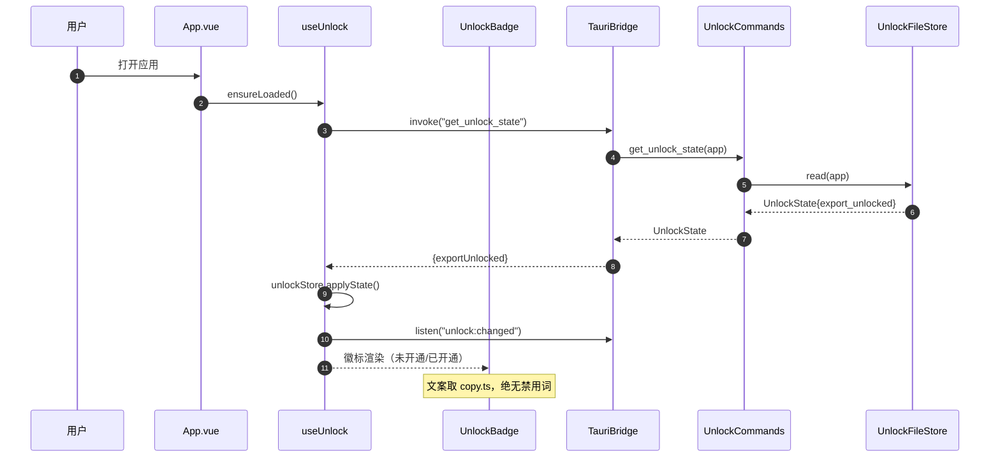
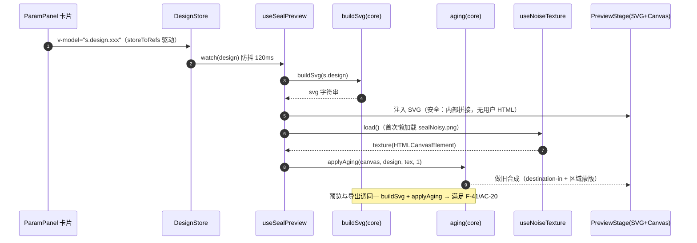
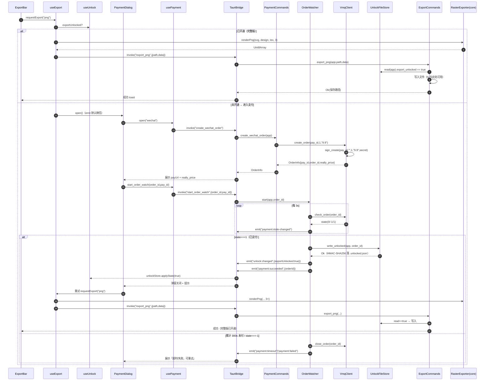

# 架构设计：印章生成器（Seal Designer）

**Status**: 已接受（阶段 2 交付）
**Author**: Lin（架构师）
**Last Updated**: 2025-08-02
**Version**: 1.0.0.0
**输入**: `PRD.md`（阶段 1）、`项目需要信息.md`、`AGENTS.md` 十二项硬约束、`规则/UI规则.md`、`规则/支付规则.md`、`问题/_索引.md`（20 普遍 + 2 项目问题）
**下游**: 工程师 Sam（阶段 3）、QA Robin（阶段 4~6）

> **禁用词纪律**：本文档与后续全部代码的**标识符、状态枚举、UI 文案**均不得出现「激活 / 未激活 / 已激活 / 会员 / vip / VIP / 订阅」。统一措辞：**开通 / 解锁 / 未开通 / 已开通 / 完整版**。架构层的命名基线：`export_unlocked`、`UnlockState`、`unlock/`、`useUnlock`。

---

## 0. 主理人拍板结论（Q1~Q8 已确认，直接作为设计输入）

| # | 问题 | 拍板结论 | 架构落点 |
|---|---|---|---|
| Q1 | 导出图水印 | V1 **不加**图水印 | 导出管线无水印层；合规靠 F-47 关于页 |
| Q2 | 中文字体 | 系统字体回退栈 + 运行时可用性探测（**不嵌入** CJK 字体） | `src/core/fonts.ts`，详见 **ADR-005** |
| Q3 | 保存/载入草稿 | V1 **不做** | 不建 `draft` 模块；store 结构预留可序列化（未来低成本补） |
| Q4 | 复制图片到剪贴板 | V1 **不做** | 不引入 clipboard 插件 |
| Q5 | 解锁措辞 | 未开通→「未开通导出功能」；已开通→「已开通导出功能（完整版）」；按钮→「开通导出功能」 | `src/core/copy.ts` 文案常量表（单点收敛，便于 QA 扫描） |
| Q6 | 解锁状态文件 | `app_data_dir` 下隐藏文件 `.unlocked.json`，含 `exportUnlocked: bool` | `src-tauri/src/unlock/store.rs`，详见 **ADR-002** |
| Q7 | 导出 PNG | 保留 3×，尺寸 200–700px（导出最大 ~2100px 透明 PNG） | `src/core/render/exportRaster.ts` |
| Q8 | 关于/免责页 | 实现（P1），文案「仅供设计参考与娱乐，请遵守相关法律法规」 | `src/views/AboutView.vue` |

---

## 1. 实现方案与框架选型（Implementation Approach）

### 1.1 需求的四个真正难点

| # | 难点 | 本质 | 裁决 |
|---|---|---|---|
| D1 | **预览与导出必须像素级同源**（F-41 / AC-20） | 网页版预览走 SVG→Canvas→噪声合成，导出走同一链路但 3× 放大。若在 Rust 侧重写渲染（resvg + image），做旧算法会与前端产生视觉漂移 | **渲染 100% 留在前端**（Canvas 2D + SVG 字符串）；Rust 只做「闸门 + 落盘」。见 **ADR-007** |
| D2 | **MSIX 分发**（约束 1 / 问题 012） | Tauri 2 的 Windows bundler 只实现 MSI/NSIS，**没有 MSIX target** | `bundle.targets: ["nsis"]`；MSIX 由 CI 用 `makeappx pack` 手工打包。见 **ADR-001** |
| D3 | **软锁不可被前端绕过、又不能引入服务器** | 前端 JS 天然可篡改；但约束 7 明令「无服务器激活码」 | 闸门下沉到 Rust 命令：**文件写入只有 `export_png` / `export_svg` 两个 Rust 命令能做**，且不开放 `fs` 插件写权限。见 **ADR-003 / ADR-007** |
| D4 | **做旧效果依赖 3.7MB 外部纹理，且不能污染 Canvas** | 网页版把纹理内联成 5MB base64 以规避跨源污染（tainted canvas）；桌面端必须换方案 | `sealNoisy.png` 放 `public/textures/`，由 WebView **同源**加载 → `drawImage` 不污染 → `toBlob` 可用。见 **ADR-006** |

### 1.2 技术栈（固定，不可偏离）

| 层 | 选型 | 版本基线 | 理由 |
|---|---|---|---|
| 桌面框架 | **Tauri 2** | 2.x | AGENTS 固定栈；单 exe（前端资源内嵌）、MSIX 友好、体积小 |
| 前端框架 | **Vue 3**（Composition API + `<script setup>` + TS） | 3.4+ | AGENTS 固定栈 |
| 后端 | **Rust** | 1.77+ | AGENTS 固定栈 |
| 构建 | **Vite 5** | 5.x | Tauri 2 官方模板默认 |
| 状态管理 | **Pinia** | 2.x | 参数面板 30+ 字段需跨组件共享；`storeToRefs` + `watch` 天然驱动重渲染 |
| 路由 | **vue-router 4** | 4.x | 仅 2 个视图（设计器 / 关于）；**不设任何权限守卫**（软锁纪律） |
| 样式 | **原生 CSS 自定义属性（Paper Design Token）** | — | **不引入 Tailwind / 任何 UI 库**。UI规则明确 Token 是"设计系统 Token 而非 Tailwind class"，需自行映射；引入 Tailwind 反而增加映射层与构建复杂度 |
| 字体 | `@fontsource/montserrat`（本地打包，拉丁子集） | 5.x | UI规则要求 Montserrat；G3 要求 100% 离线 → **禁止 Google Fonts CDN** |
| 渲染 | 浏览器原生 **SVG + Canvas 2D** | — | 零依赖，与网页版基线 1:1 可移植 |
| HTTP（Rust） | `reqwest`（rustls-tls） | 0.12 | 避免 Windows 上的 OpenSSL 依赖 |
| 二维码 | **无库**（本地静态 PNG） | — | 约束 2 硬性要求 |

### 1.3 架构模式

**模块化单体 + 两层边界**（不引入事件总线、不引入微前端、不引入 DI 容器 —— 约束 9「简单软件」）：

```
┌───────────────────────────────────────────────────────────────┐
│  Vue 3 前端层（UI + 全部渲染）                                  │
│  ┌───────────┐ ┌────────────┐ ┌──────────┐ ┌───────────────┐ │
│  │ views/    │ │components/ │ │composables│ │ stores/(Pinia)│ │
│  │ 设计器/关于│ │参数面板/预览│ │ 编排逻辑  │ │ design/unlock │ │
│  └─────┬─────┘ └─────┬──────┘ └─────┬────┘ └───────┬───────┘ │
│        └─────────────┴──────┬───────┴──────────────┘         │
│                             ▼                                 │
│  ┌──────────────────────────────────────────────────────────┐│
│  │  core/  纯函数域层（零 Vue 依赖，可单测）                   ││
│  │  types · defaults · presets · palette · fonts · copy      ││
│  │  geometry · buildSvg · aging · exportRaster               ││
│  │  ★ 预览与导出调用同一份 buildSvg + aging → 保证 F-41       ││
│  └──────────────────────────────────────────────────────────┘│
│                             │ invoke() / listen()             │
├─────────────────────────────┼─────────────────────────────────┤
│                    Tauri 2 IPC 桥                             │
├─────────────────────────────┼─────────────────────────────────┤
│                             ▼                                 │
│  Rust 后端命令层（闸门 + 外部世界）                             │
│  ┌────────────┐ ┌─────────────┐ ┌───────────┐ ┌────────────┐│
│  │ commands/  │ │  payment/   │ │  unlock/  │ │  config.rs ││
│  │ 薄适配层    │ │ V免签客户端  │ │ 本地状态文件│ │ 常量凭据   ││
│  │            │ │ 签名/轮询任务│ │ + HMAC 校验│ │            ││
│  └────────────┘ └─────────────┘ └───────────┘ └────────────┘│
└───────────────────────────────────────────────────────────────┘
```

**职责红线（工程师必须遵守）：**

1. Rust **不做任何印章渲染**。
2. 前端 **不做任何网络请求**（V免签只在 Rust；CSP 的 `connect-src` 不含外网域名）。
3. 前端 **不直接写文件**（`fs` 插件不授予写权限；落盘只能走 `export_png` / `export_svg`）。
4. `core/` 目录 **不 import 任何 Vue / Tauri API**（保证可被 preview 与 export 双路径复用）。

---

## 2. 文件列表（完整相对路径树）

> 项目根 = `项目/印章生成器/`（约束 12：即 GitHub 仓库根目录）。GitHub 仓库名用 ASCII：`seal-designer`。

```
项目/印章生成器/
├── PRD.md                                  # 阶段 1 产出
├── 架构设计.md                              # 本文件
├── ADR/                                     # 架构决策记录（8 份）
│   ├── ADR-001-MSIX打包路线.md
│   ├── ADR-002-本地解锁状态存储.md
│   ├── ADR-003-支付模块边界与Rust侧调用.md
│   ├── ADR-004-名字与微软身份分离策略.md
│   ├── ADR-005-字体方案与文字渲染.md
│   ├── ADR-006-做旧纹理复用与预览导出一致性.md
│   ├── ADR-007-导出管线职责划分与软锁闸门.md
│   └── ADR-008-前端状态管理与PaperDesign落地.md
├── docs/
│   ├── class-diagram.mermaid                # 数据结构与接口（类图）
│   └── sequence-diagram.mermaid             # 程序调用流程（时序图）
├── package.json
├── package-lock.json
├── tsconfig.json
├── tsconfig.node.json
├── vite.config.ts
├── index.html
├── .gitignore
├── README.md
│
├── public/                                  # 同源静态资源（随 frontendDist 内嵌进 exe）
│   ├── textures/
│   │   └── sealNoisy.png                    # ← 来自 seal-designer-main/sealNoisy.png（3.7MB）
│   └── pay/
│       ├── weixin.png                       # ← 来自 支付二维码/weixin.png
│       └── zhifubao.png                     # ← 来自 支付二维码/zhifubao.png
│
├── src/                                     # Vue 3 前端
│   ├── main.ts                              # createApp + pinia + router + 样式入口
│   ├── App.vue                              # 外壳：AppHeader + <RouterView> + ToastHost + PaymentDialog
│   ├── env.d.ts
│   │
│   ├── router/
│   │   └── index.ts                         # 2 条路由，★ 无任何 beforeEach 权限守卫
│   │
│   ├── views/
│   │   ├── DesignerView.vue                 # 主界面：左 ParamPanel + 右 PreviewStage
│   │   └── AboutView.vue                    # F-47 关于/免责声明
│   │
│   ├── core/                                # ★ 纯函数域层（零 Vue / 零 Tauri 依赖）
│   │   ├── types.ts                         # SealDesign 及全部枚举、区间常量
│   │   ├── defaults.ts                      # createDefaultDesign()
│   │   ├── constraints.ts                   # F-04 形状↔排版联动约束、行数 1–8 夹取
│   │   ├── presets.ts                       # F-39 四套快速预设
│   │   ├── palette.ts                       # F-29 七色印色表（业务数据，非 UI Token）
│   │   ├── fonts.ts                         # F-30 字体栈 + isFontAvailable() 探测
│   │   ├── copy.ts                          # ★ 全量用户可见文案常量（禁用词单点防线）
│   │   ├── geometry.ts                      # starPoints / roundedRectPath / computeArcChars
│   │   ├── buildSvg.ts                      # SealDesign → SVG 字符串（预览与导出共用）
│   │   ├── aging.ts                         # 做旧合成：applyAging() / generateProceduralNoise()
│   │   └── exportRaster.ts                  # SVG 字符串 → 3× 透明 PNG Uint8Array
│   │
│   ├── stores/
│   │   ├── design.ts                        # Pinia：SealDesign 全量参数 + 联动 action
│   │   └── unlock.ts                        # Pinia：exportUnlocked 状态镜像
│   │
│   ├── composables/
│   │   ├── useNoiseTexture.ts               # sealNoisy.png 懒加载 + 程序化兜底（F-38）
│   │   ├── useSealPreview.ts                # 防抖重渲染 → SVG DOM + 做旧 canvas
│   │   ├── useExport.ts                     # 导出编排：闸门 → 渲染 → 保存对话框 → invoke
│   │   ├── useUnlock.ts                     # 读取/监听解锁状态
│   │   ├── usePayment.ts                    # 支付会话：建单 → 监听事件 → 倒计时 → 收尾
│   │   └── useToast.ts
│   │
│   ├── components/
│   │   ├── layout/
│   │   │   ├── AppHeader.vue                # 标题 + UnlockBadge + 关于入口
│   │   │   └── ToastHost.vue
│   │   ├── panel/
│   │   │   ├── ParamPanel.vue               # 卡片容器与顺序编排
│   │   │   ├── ShapeTypeCard.vue            # F-01 ~ F-04
│   │   │   ├── BorderCard.vue               # F-05 ~ F-07
│   │   │   ├── CenterCard.vue               # F-08 ~ F-10（仅公章样式显示）
│   │   │   ├── GongzhangTextCard.vue        # F-11 ~ F-15
│   │   │   ├── FangzhangTextCard.vue        # F-16 ~ F-18
│   │   │   ├── FreeTextCard.vue             # F-19 ~ F-20
│   │   │   ├── AdjustCard.vue               # F-21 ~ F-27
│   │   │   ├── ColorCard.vue                # F-28 / F-29
│   │   │   ├── FontCard.vue                 # F-30 / F-31（含字体缺失提示）
│   │   │   ├── RealisticCard.vue            # F-32 ~ F-36
│   │   │   └── PresetCard.vue               # F-39
│   │   ├── preview/
│   │   │   ├── PreviewStage.vue             # F-40 棋盘格底 + SVG/Canvas 挂载
│   │   │   └── ExportBar.vue                # F-42 / F-43 受限按钮（★ 唯一软锁拦截点）
│   │   ├── payment/
│   │   │   ├── PaymentDialog.vue            # 支付弹窗（默认微信 / 支付宝显式）
│   │   │   └── UnlockBadge.vue              # 「未开通导出功能 / 已开通导出功能（完整版）」
│   │   └── ui/                              # Paper Design 基础件（全部用 Token，无硬编码 hex）
│   │       ├── PaperCard.vue
│   │       ├── PaperButton.vue
│   │       ├── PaperSegmented.vue
│   │       ├── PaperSlider.vue
│   │       ├── PaperInput.vue
│   │       ├── PaperSelect.vue
│   │       ├── PaperToggle.vue
│   │       ├── PaperModal.vue
│   │       └── PaperBadge.vue
│   │
│   └── styles/
│       ├── tokens.css                       # ★ Paper Design 全量 Token（含 dark 媒体查询）
│       ├── base.css                         # reset + Montserrat + 中文回退 + 抗锯齿
│       └── paper-texture.css                # 纸纹/网格叠层工具类
│
├── src-tauri/                               # Rust 后端
│   ├── Cargo.toml                           # [package] name = "seal-designer"（ASCII）
│   ├── Cargo.lock
│   ├── build.rs
│   ├── tauri.conf.json                      # ★ productName 中文 / mainBinaryName ASCII / targets=["nsis"]
│   ├── capabilities/
│   │   └default.json                       # 最小权限：core:default + dialog:allow-save
│   ├── icons/                               # ★ 由 `npx @tauri-apps/cli icon ../icon.png` 生成
│   │   ├── 32x32.png · 128x128.png · 128x128@2x.png · icon.ico · icon.png
│   │   ├── StoreLogo.png
│   │   ├── Square44x44Logo.png
│   │   └── Square150x150Logo.png            # （其余尺寸一并生成，MSIX 只取这 3 张）
│   ├── msix/
│   │   └── AppxManifest.xml                 # ★ 微软身份主战场（模板，CI 注入版本号）
│   └── src/
│       ├── main.rs                          # ★ #![cfg_attr(not(debug_assertions), windows_subsystem = "windows")]
│       ├── lib.rs                           # Builder / 插件 / invoke_handler / 托管状态
│       ├── config.rs                        # V免签凭据、价格、轮询与超时常量
│       ├── error.rs                         # AppError（Serialize）统一错误
│       ├── commands/
│       │   ├── mod.rs
│       │   ├── payment.rs                   # 7 个支付命令
│       │   ├── unlock.rs                    # get_unlock_state（+ debug-only 开关）
│       │   ├── export.rs                    # export_png / export_svg（★ 闸门）
│       │   └── app_info.rs                  # get_app_info
│       ├── payment/
│       │   ├── mod.rs
│       │   ├── models.rs                    # CreateOrderReq/Resp、CheckResp、OrderInfo
│       │   ├── sign.rs                      # md5 签名（param 恒为 &str，永不 null）
│       │   ├── vmq_client.rs                # reqwest 客户端：create / check / close
│       │   └── watcher.rs                   # ★ 3s 轮询 + 300s 超时 tokio 任务 + 事件广播
│       └── unlock/
│           ├── mod.rs
│           └── store.rs                     # .unlocked.json 原子读写 + HMAC-SHA256 校验
│
└── .github/
    ├── scripts/
    │   └── pack-msix.ps1                    # ★ 白名单 staging + makeappx pack + 污染自检
    └── workflows/
        └── build-release.yml                # NSIS + MSIX + Release（跳过 artifact）
```

**文件数量控制说明**：`ui/` 下 9 个基础组件是 Paper Design 三态（hover/focus/disabled）与 Token 约束的落点，避免在 12 张参数卡片里重复实现 —— 这是唯一被允许的"抽象"，其余一律直白实现。

---

## 3. 数据结构与接口（Data Structures & Interfaces）

### 3.1 类图

```mermaid
classDiagram
    direction LR

    class SealDesign {
        +shape: Shape
        +sealType: SealType
        +layoutStyle: LayoutStyle
        +arrangement: Arrangement
        +borderStyle: BorderStyle
        +borderGap: number
        +borderWidth: number
        +sealSize: number
        +fontSize: number
        +bottomFontSize: number
        +centerFontSize: number
        +starSize: number
        +topCharGap: number
        +bottomCharGap: number
        +topArcDeg: number
        +bottomArcDeg: number
        +topMargin: number
        +bottomMargin: number
        +centerLineGap: number
        +centerOffset: number
        +centerBottomGap: number
        +sealColor: string
        +fontFamily: string
        +bold: boolean
        +centerStyle: CenterStyle
        +centerSymbol: string
        +arcTopText: string
        +arcBottomText: string
        +centerText1: string
        +centerText2: string
        +serialNumber: string
        +gongzhangSubText: string
        +fangTexts: string[]
        +fangzhangSubText: string
        +fangLineGap: number
        +freeTexts: string[]
        +freeSubText: string
        +freeSpacing: number
        +realistic: boolean
        +wearLevel: number
        +wearX: number
        +wearY: number
        +wearSize: number
        +wearFeather: number
    }

    class DesignStore {
        +design: SealDesign
        +setShape(s) void
        +setLayoutStyle(l) void
        +addTextRow(kind) void
        +removeTextRow(kind, i) void
        +applyPreset(key) void
        +setColor(hex) void
        +reset() void
    }

    class UnlockStore {
        +exportUnlocked: boolean
        +loaded: boolean
        +refresh() Promise
        +applyState(s) void
    }

    class SealSvgBuilder {
        <<module core/buildSvg>>
        +buildSvg(d: SealDesign) string
    }
    class AgingComposer {
        <<module core/aging>>
        +applyAging(canvas, d, tex, scale) void
        +generateProceduralNoise(size, density) HTMLCanvasElement
    }
    class RasterExporter {
        <<module core/exportRaster>>
        +renderPng(svg, d, tex, scale) Promise~Uint8Array~
    }
    class GeometryUtil {
        <<module core/geometry>>
        +starPoints(cx, cy, oR, iR) string
        +roundedRectPath(x, y, w, h, r) string
        +computeArcChars(text, cx, cy, r, deg, side, isEllipse, offset, gap) ArcChar[]
    }
    class FontRegistry {
        <<module core/fonts>>
        +FONT_OPTIONS: FontOption[]
        +isFontAvailable(stack) boolean
    }
    class PresetRegistry {
        <<module core/presets>>
        +PRESETS: Record~PresetKey, Partial~SealDesign~~
    }
    class CopyText {
        <<module core/copy>>
        +UNLOCK_LOCKED: string
        +UNLOCK_OPEN: string
        +BTN_UNLOCK: string
        +DISCLAIMER: string
    }

    class useSealPreview {
        <<composable>>
        +svgEl: Ref
        +rerender() void
    }
    class useNoiseTexture {
        <<composable>>
        +texture: Ref~HTMLCanvasElement~
        +ready: Ref~boolean~
        +load() Promise
    }
    class useExport {
        <<composable>>
        +requestExport(fmt) Promise
    }
    class usePayment {
        <<composable>>
        +session: Ref~PaySession~
        +open(channel) Promise
        +switchToAlipay() Promise
        +cancel() Promise
    }
    class useUnlock {
        <<composable>>
        +exportUnlocked: Ref~boolean~
        +ensureLoaded() Promise
    }

    class TauriBridge {
        <<Tauri IPC>>
        +invoke(cmd, args) Promise
        +listen(event, cb) UnlistenFn
    }

    class PaymentCommands {
        <<rust commands/payment.rs>>
        +create_wechat_order(app) OrderInfo
        +create_alipay_order(app) OrderInfo
        +poll_order(order_id) OrderStatus
        +start_order_watch(app, order_id) void
        +cancel_order_watch(app) void
        +close_order(order_id) void
        +get_pay_config() PayConfig
    }
    class UnlockCommands {
        <<rust commands/unlock.rs>>
        +get_unlock_state(app) UnlockState
    }
    class ExportCommands {
        <<rust commands/export.rs>>
        +export_png(app, path, data) String
        +export_svg(app, path, svg) String
    }
    class AppInfoCommands {
        <<rust commands/app_info.rs>>
        +get_app_info(app) AppInfo
    }

    class VmqClient {
        <<rust payment/vmq_client.rs>>
        -http: reqwest.Client
        +create_order(pay_id, ty, price) OrderInfo
        +check_order(order_id) i8
        +close_order(order_id) bool
    }
    class Signer {
        <<rust payment/sign.rs>>
        +sign_create(pay_id, param, ty, price, secret) String
        +sign_query(order_id, secret) String
    }
    class OrderWatcher {
        <<rust payment/watcher.rs>>
        -handle: Option~JoinHandle~
        +start(app, order_id) void
        +cancel() void
    }
    class UnlockFileStore {
        <<rust unlock/store.rs>>
        +read(app) UnlockState
        +write_unlocked(app, order_ref) Result
        -sign(payload) String
        -verify(payload, sig) bool
    }

    class OrderInfo {
        +order_id: String
        +pay_id: String
        +channel: u8
        +price: String
        +really_price: String
    }
    class OrderStatus {
        +state: i8
        +state_text: String
    }
    class UnlockState {
        +export_unlocked: bool
    }
    class PayConfig {
        +price: String
        +poll_interval_secs: u64
        +timeout_secs: u64
    }
    class AppInfo {
        +product_name: String
        +version: String
    }

    DesignStore --> SealDesign : holds
    DesignStore ..> PresetRegistry : uses
    useSealPreview ..> SealSvgBuilder : uses
    useSealPreview ..> AgingComposer : uses
    useSealPreview ..> useNoiseTexture : uses
    useExport ..> RasterExporter : uses
    useExport ..> SealSvgBuilder : uses
    useExport ..> useUnlock : gate check
    useExport ..> usePayment : opens on locked
    RasterExporter ..> AgingComposer : reuses
    SealSvgBuilder ..> GeometryUtil : uses
    SealSvgBuilder ..> FontRegistry : uses
    useUnlock --> UnlockStore : syncs
    useExport ..> TauriBridge : invoke
    usePayment ..> TauriBridge : invoke + listen
    useUnlock ..> TauriBridge : invoke + listen
    TauriBridge ..> PaymentCommands
    TauriBridge ..> UnlockCommands
    TauriBridge ..> ExportCommands
    TauriBridge ..> AppInfoCommands
    PaymentCommands --> VmqClient
    PaymentCommands --> OrderWatcher
    VmqClient --> Signer
    VmqClient ..> OrderInfo : returns
    VmqClient ..> OrderStatus : returns
    OrderWatcher --> VmqClient : polls 3s
    OrderWatcher --> UnlockFileStore : write on paid
    UnlockCommands --> UnlockFileStore
    UnlockFileStore ..> UnlockState : returns
    ExportCommands --> UnlockFileStore : gate
    PaymentCommands ..> PayConfig : returns
    AppInfoCommands ..> AppInfo : returns
    ExportBar ..> useExport
    PaymentDialog ..> usePayment
    UnlockBadge ..> useUnlock
    ParamPanel --> DesignStore
    PreviewStage ..> useSealPreview

    class ExportBar
    class PaymentDialog
    class UnlockBadge
    class ParamPanel
    class PreviewStage
```



### 3.2 前端域模型（`src/core/types.ts`）

```ts
export type Shape        = 'circle' | 'ellipse' | 'square';
export type SealType     = 'yangwen' | 'yinwen';                 // 朱文(阳文) / 白文(阴文)
export type LayoutStyle  = 'gongzhang' | 'fangzhang' | 'free';
export type Arrangement  = 'horizontal' | 'vertical';
export type BorderStyle  = 'double' | 'single' | 'none';
export type CenterStyle  = 'star' | 'text' | 'none';
export type PresetKey    = 'company' | 'contract' | 'finance' | 'personal';
export type ExportFormat = 'png' | 'svg';

export interface SealDesign { /* 见类图，与网页版 S 对象字段一一对齐，禁止改名 */ }

/** 单一数值区间真相源（滑块 min/max/step 与 store 夹取共用） */
export const RANGES = {
  sealSize:        { min: 200, max: 700, step: 5   },  // F-21
  borderWidth:     { min: 1,   max: 20,  step: 0.5 },  // F-07
  borderGap:       { min: 2,   max: 30,  step: 1   },  // F-06
  fontSize:        { min: 22,  max: 100, step: 1   },  // F-22
  topCharGap:      { min: -8,  max: 20,  step: 0.5 },
  topArcDeg:       { min: 120, max: 300, step: 5   },
  topMargin:       { min: 0,   max: 60,  step: 1   },
  bottomFontSize:  { min: 14,  max: 60,  step: 1   },  // F-23
  bottomCharGap:   { min: -5,  max: 15,  step: 0.5 },
  bottomArcDeg:    { min: 90,  max: 240, step: 5   },
  bottomMargin:    { min: 0,   max: 60,  step: 1   },
  centerFontSize:  { min: 20,  max: 100, step: 1   },  // F-24
  centerLineGap:   { min: 0,   max: 30,  step: 1   },
  centerOffset:    { min: 0,   max: 50,  step: 1   },
  centerBottomGap: { min: 0,   max: 50,  step: 1   },
  starSize:        { min: 0,   max: 260, step: 2   },  // F-09 / F-25
  freeSpacing:     { min: 0,   max: 40,  step: 1   },  // F-26
  fangLineGap:     { min: 0,   max: 40,  step: 1   },  // F-27
  wearLevel:       { min: 0.5, max: 2,   step: 0.05 }, // F-33
  wearX:           { min: -200, max: 200, step: 2  },  // F-34
  wearY:           { min: -200, max: 200, step: 2  },
  wearSize:        { min: 20,  max: 200, step: 5   },  // F-35
  wearFeather:     { min: 0,   max: 60,  step: 2   },  // F-36
} as const;

/** 文本长度上限（F-11~F-20） */
export const LIMITS = {
  arcTopText: 50, arcBottomText: 30, centerText: 16, serialNumber: 30,
  subText: 30, rowText: 20, centerSymbol: 4, maxRows: 8, minRows: 1,
} as const;
```

`src/core/palette.ts`（**业务数据，非 UI Token —— QA 扫描 hex 时请豁免此文件**）：

| 名称 | 值 | 名称 | 值 |
|---|---|---|---|
| 朱红 | `#FF0000` | 藏蓝 | `#1A3A6B` |
| 暗红 | `#8B1A1A` | 墨绿 | `#2D5A27` |
| 砖红 | `#B22222` | 紫 | `#6B3A8B` |
| 墨黑 | `#1A1A1A` | *默认印色* | `#C23B3B` |

`src/core/fonts.ts`：

| 显示名 | CSS 栈 | Windows 自带 |
|---|---|---|
| 宋体（公章标准） | `'SimSun','STSong','NSimSun',serif` | ✅ |
| 黑体 | `'SimHei','STHeiti','Microsoft YaHei',sans-serif` | ✅ |
| 楷体 | `'KaiTi','STKaiti',serif` | ✅ |
| 仿宋 | `'FangSong','STFangsong',serif` | ✅ |
| 隶书 | `'LiSu','STLiti',serif` | ⚠️ 中文版自带，英文版需可选功能 → 运行时探测（ADR-005） |

### 3.3 Rust 命令签名（IPC 契约）

> 命名纪律：字段一律 `snake_case`（Rust）↔ Tauri 自动映射到前端 `camelCase`（`#[serde(rename_all = "camelCase")]`）。

```rust
// ── 解锁 ─────────────────────────────────────────────
#[derive(Serialize)] #[serde(rename_all = "camelCase")]
pub struct UnlockState { pub export_unlocked: bool }

#[tauri::command] pub fn get_unlock_state(app: AppHandle) -> UnlockState;

/// 仅 debug 构建注册，release 不编译 —— 避免前端自助解锁
#[cfg(debug_assertions)]
#[tauri::command] pub fn dev_set_export_unlocked(app: AppHandle, v: bool) -> Result<(), AppError>;

// ── 支付 ─────────────────────────────────────────────
#[derive(Serialize)] #[serde(rename_all = "camelCase")]
pub struct OrderInfo {
    pub order_id: String,     // V免签系统单号（轮询用）
    pub pay_id: String,       // 商户单号 SEAL{ms}{rand4}
    pub channel: u8,          // 1=微信 2=支付宝
    pub price: String,        // "9.9"
    pub really_price: String, // ★ 实际应付金额（本地静态码模式必须显示此值）
}
#[derive(Serialize)] #[serde(rename_all = "camelCase")]
pub struct OrderStatus { pub state: i8, pub state_text: String }  // 0未付 1已付 -1关闭

#[derive(Serialize)] #[serde(rename_all = "camelCase")]
pub struct PayConfig { pub price: String, pub poll_interval_secs: u64, pub timeout_secs: u64 }

#[tauri::command] pub async fn create_wechat_order(app: AppHandle) -> Result<OrderInfo, AppError>;
#[tauri::command] pub async fn create_alipay_order(app: AppHandle) -> Result<OrderInfo, AppError>;
#[tauri::command] pub async fn poll_order(order_id: String) -> Result<OrderStatus, AppError>;
#[tauri::command] pub fn  start_order_watch(app: AppHandle, order_id: String, pay_id: String);
#[tauri::command] pub fn  cancel_order_watch(app: AppHandle);
#[tauri::command] pub async fn close_order(order_id: String) -> Result<(), AppError>;
#[tauri::command] pub fn  get_pay_config() -> PayConfig;

// ── 导出（★ 软锁闸门在此，不在前端） ────────────────────
#[tauri::command] pub fn export_png(app: AppHandle, path: String, data: Vec<u8>) -> Result<String, AppError>;
#[tauri::command] pub fn export_svg(app: AppHandle, path: String, svg: String)   -> Result<String, AppError>;
// 两者首行均为：if !unlock::store::read(&app).export_unlocked { return Err(AppError::Locked) }

// ── 应用信息 ─────────────────────────────────────────
#[derive(Serialize)] #[serde(rename_all = "camelCase")]
pub struct AppInfo { pub product_name: String, pub version: String }
#[tauri::command] pub fn get_app_info(app: AppHandle) -> AppInfo;
```

**Rust → 前端事件（中性命名，无禁用词）**

| 事件名 | payload | 触发时机 |
|---|---|---|
| `payment:state-changed` | `{ orderId, state, elapsedSecs }` | 每次轮询返回（3s） |
| `payment:succeeded` | `{ orderId }` | `state === 1`，**且解锁文件已写入成功之后** |
| `payment:timeout` | `{ orderId }` | 累计 300s 未支付（Rust 已同时调用 `close_order`） |
| `payment:failed` | `{ orderId, message }` | `state === -1` 或网络/签名错误 |
| `unlock:changed` | `{ exportUnlocked }` | 解锁文件写入后立即广播（唯一状态源） |

### 3.4 Vue 组件契约（props / emits）

| 组件 | props | emits |
|---|---|---|
| `PaperSlider` | `modelValue:number`, `min`, `max`, `step`, `label:string`, `suffix?:string`, `disabled?:boolean` | `update:modelValue` |
| `PaperSegmented` | `modelValue:string`, `options:{value,label}[]`, `label?:string` | `update:modelValue` |
| `PaperToggle` | `modelValue:boolean`, `label:string`, `disabled?` | `update:modelValue` |
| `PaperSelect` | `modelValue:string`, `options:{value,label,hint?}[]` | `update:modelValue` |
| `PaperInput` | `modelValue:string`, `label`, `maxlength:number`, `placeholder?` | `update:modelValue` |
| `PaperModal` | `open:boolean`, `title:string`, `closable?:boolean` | `close` |
| `PaperButton` | `variant:'primary'\|'secondary'\|'outline'\|'ghost'\|'dark'`, `size`, `disabled?`, `loading?` | `click` |
| `PaperCard` | `title:string`, `collapsible?:boolean`, `interactive?:boolean` | — |
| `PaperBadge` | `variant:'neutral'\|'success'\|'warning'`, `text:string` | — |
| `ParamPanel` | *(无 props，直连 `useDesignStore()`)* | — |
| `PreviewStage` | *(无 props)* | — |
| `ExportBar` | *(无 props)* | — |
| `PaymentDialog` | `open:boolean` | `close`, `unlocked` |
| `UnlockBadge` | *(无 props)* | — |

> 参数卡片一律**不接收 props**，直接 `const s = useDesignStore()` + `v-model="s.design.xxx"`。避免 12 层 props 透传 —— 这是本项目刻意选择的"务实耦合"。

---

## 4. 程序调用流程（Program Call Flow）

> 三张时序图覆盖全部关键路径：应用初始化、设计器实时预览、导出（含未开通→支付→解锁→落盘全链路）。`docs/sequence-diagram.mermaid` 为可执行副本。

### 4.1 应用初始化（启动 → 解锁态同步 → 路由就绪）



### 4.2 设计器实时预览（参数变更 → 防抖重渲染）



### 4.3 导出全链路（未开通拦截 → 支付 → 解锁 → 落盘）



---

## 5. 任务列表（有序、含依赖、按实现顺序）

> 工程师 Sam 按 T01→T09 顺序实现。每个任务产出需可被下一任务复用。**禁止**在 T07 之前触碰 `src-tauri` 支付与导出（前置为 T06 解锁态与资源就绪）。

| Task | 名称 | 源文件（新建/修改） | 依赖 | 优先级 |
|---|---|---|---|---|
| **T01** | 项目脚手架与配置基线 | `package.json`,`tsconfig.json`,`tsconfig.node.json`,`vite.config.ts`,`index.html`,`.gitignore`,`src/main.ts`,`src/App.vue`,`src/env.d.ts`,`src/router/index.ts`,`src-tauri/Cargo.toml`,`src-tauri/build.rs`,`src-tauri/tauri.conf.json`,`src-tauri/src/lib.rs`,`src-tauri/src/main.rs`,`src-tauri/capabilities/default.json`,`src-tauri/icons/*` | — | P0 |
| **T02** | 核心域模型与纯函数层 | `src/core/types.ts`,`defaults.ts`,`constraints.ts`,`palette.ts`,`fonts.ts`,`copy.ts`,`geometry.ts`,`buildSvg.ts`,`aging.ts` | T01 | P0 |
| **T03** | 前端状态管理与 Paper Design 基础设施 | `src/stores/design.ts`,`src/stores/unlock.ts`,`src/styles/tokens.css`,`src/styles/base.css`,`src/styles/paper-texture.css`,`src/components/ui/*`(9),`src/composables/useToast.ts` | T02 | P0 |
| **T04** | 参数面板与预览（设计器主界面） | `src/views/DesignerView.vue`,`src/components/panel/*`(12),`src/components/preview/PreviewStage.vue`,`src/components/layout/AppHeader.vue`,`src/components/layout/ToastHost.vue`,`src/composables/useSealPreview.ts`,`useNoiseTexture.ts` | T03 | P0 |
| **T05** | 做旧纹理资源与导出栅格管线 | `public/textures/sealNoisy.png`,`src/core/exportRaster.ts`,`src/components/preview/ExportBar.vue`,`src/composables/useExport.ts` | T04 | P1 |
| **T06** | Rust 解锁态与本地持久化 | `src-tauri/src/commands/unlock.rs`,`src-tauri/src/unlock/mod.rs`,`src-tauri/src/unlock/store.rs`,`src-tauri/src/error.rs`,`src-tauri/src/config.rs` | T01 | P1 |
| **T07** | Rust 支付模块（V免签 App Proxy） | `src-tauri/src/commands/payment.rs`,`src-tauri/src/payment/mod.rs`,`src-tauri/src/payment/models.rs`,`sign.rs`,`vmq_client.rs`,`watcher.rs`,`src/core/presets.ts`(前端预设),`src/components/payment/PaymentDialog.vue`,`src/composables/usePayment.ts`,`useUnlock.ts` | T06,T05 | P1 |
| **T08** | 软锁闸门、导出命令与关于页 | `src-tauri/src/commands/export.rs`,`src-tauri/src/commands/app_info.rs`,`src/components/payment/UnlockBadge.vue`,`src/views/AboutView.vue`,`public/pay/weixin.png`,`public/pay/zhifubao.png` | T07 | P1 |
| **T09** | 打包与分发流水线 | `src-tauri/msix/AppxManifest.xml`,`.github/scripts/pack-msix.ps1`,`.github/workflows/build-release.yml`,`README.md` | T08 | P1 |

> 依赖链：`T01 → T02 → T03 → T04 → T05` 与 `T01 → T06 → T07 → T08 → T09` 两条主链；T05、T06 在 T01 之后即可并行开工。T09 必须在 T08 全部命令注册完成后（AppxManifest 的 Identity 需与 tauri.conf 一致）。

---

## 6. 依赖包列表（Required Packages）

### 6.1 前端 npm 依赖

```
- vue@^3.4.0               # 前端框架（Composition API + <script setup>）
- vue-router@^4.3.0        # 仅 2 路由，无守卫
- pinia@^2.1.0             # 设计参数 / 解锁态状态管理
- @tauri-apps/api@^2.0.0   # invoke / listen
- @tauri-apps/plugin-dialog@^2.0.0   # 保存文件对话框（依赖 capabilities: dialog:allow-save）
- @fontsource/montserrat@^5.0.0      # 离线拉丁字体（100% 离线，禁 CDN）
- typescript@^5.4.0
- vite@^5.2.0
- @vitejs/plugin-vue@^5.0.0
- vue-tsc@^2.0.0           # 类型检查
```

> ⚠️ **不引入**：Tailwind、任何 UI 组件库、clipboard 插件、fs 插件（写权限）、canvas 渲染库（用原生 Canvas 2D）。

### 6.2 Rust Cargo 依赖

```toml
[dependencies]
tauri = { version = "2", features = [] }
tauri-plugin-dialog = "2"
serde = { version = "1", features = ["derive"] }
serde_json = "1"
tokio = { version = "1", features = ["full"] }
reqwest = { version = "0.12", default-features = false, features = ["rustls-tls", "json", "stream"] }
md-5 = "0.10"                 # V免签签名（md5）
hmac = "0.12"                 # 解锁文件防篡改
sha2 = "0.10"                 # HMAC-SHA256 派生
base64 = "0.22"
thiserror = "1"               # AppError 派生
dirs = "5"                    # app_data_dir 定位（间接经 tauri）
```

> `tauri.conf.json` 中 `bundle` 仅开 `["nsis"]`；MSIX 走 CI 的 `makeappx`（见 ADR-001）。`fs` 插件**不启用**。

---

## 7. 共享知识（Shared Knowledge · 跨文件约定）

1. **禁用词单一防线**：所有用户可见文案集中在 `src/core/copy.ts`（含 `UNLOCK_LOCKED`/`UNLOCK_OPEN`/`BTN_UNLOCK`/`DISCLAIMER`），QA 扫描以此为白名单。**任何组件不得硬编码**「激活/会员/VIP/订阅」等词。Rust 侧事件名与枚举亦须中性（`unlock`/`export_unlocked`）。
2. **颜色双轨**：`src/core/palette.ts` 的 7 色是**业务印色**（产品功能数据，QA 扫描 hex 时豁免此文件）；`src/styles/tokens.css` 的 `--paper-*` 是 **UI Token**（Paper Design 视觉变量）。两者不得混用——组件只许引用 Token，参数面板中"印色选择"才引用 palette。
3. **设计态一致性**：`SealDesign` 字段名与网页版 `S` 对象**一一对齐、禁止改名**（保证 buildSvg 可 1:1 移植）。`core/` 目录下的模块**不得 import Vue / Tauri**（D1 硬性约束），确保 Preview 与 Export 调同一份纯函数。
4. **解锁态是 Rust 的真相源**：前端 `UnlockStore.exportUnlocked` 永远是 `get_unlock_state` 的镜像 + 监听 `unlock:changed` 事件更新；前端不持有任何可写判断逻辑。
5. **导出闸门唯一性**：落盘仅 `export_png` / `export_svg` 两个 Rust 命令；二者首行必查解锁态，未开通返回 `AppError::Locked`。前端 `ExportBar` 仅做"未开通→弹支付"的 UX 拦截，非安全边界。
6. **支付签名铁律**：`sign_create` 中 `param` 参数**恒为 `&str`（`""`），永不传 `null`**（问题 009）。`pay_id` 格式 `SEAL{ms13}{rand4}`。
7. **坐标与精度**：`core/geometry.ts` 的 `computeArcChars` 输出 `{char,x,y,angle,side}`，预览与导出共用；圆弧文字角度以中心为原点顺时针计。
8. **资源同源**：`public/textures/sealNoisy.png` 与 `public/pay/*.png` 随 `frontendDist` 内嵌，**同源加载**避免 Canvas 污染（D4）。`useNoiseTexture` 在纹理缺失时回退 `aging.generateProceduralNoise()`（程序化纤维+斑驳+麻点三层）。
9. **窗口子系统**：`src-tauri/src/main.rs` 顶部 `#![cfg_attr(not(debug_assertions), windows_subsystem = "windows")]`，release 隐藏控制台（问题 010）。
10. **版本四段**：`tauri.conf.json` `version` 用 `1.0.0`（Tauri semver 仅 3 段）；MSIX `AppxManifest` 的 `Version="1.0.0.0"` 由 CI 注入（问题/ADR-001 待明确项）。

---

## 8. 待明确事项（Anything UNCLEAR）

1. **版本号四段注入**：Tauri 2 `version` 字段仅支持 semver 三段（1.0.0），而微软要求四段（1.0.0.0）。`AppxManifest.xml` 的 `Version` 由 CI 脚本读取 `package.json` 并补 `.0` 注入。需主理人确认最终发行版本号（默认 `1.0.0.0`）。
2. **MSIX 签名证书**：`makeappx pack` 产物需 `.pfx` 签名才能侧载/上架。CI 用 GitHub Secrets 注入证书，本地验证阶段可暂用 `makeappx` 仅打包不签名（受信任侧载仍需证书）。具体证书由主理人提供（不在本仓库）。
3. **支付结果"本地静态码"语义**：V免签 App Proxy 模式下 `payUrl` 指向本地 `weixin.png`/`zhifubao.png`，`really_price` 固定显示 `9.9`。需确认：用户扫码后支付到账是否回调到 V免签再经轮询（依赖 V免签后台配置 `appId/appSecret`），本设计假设**是**。
4. **七色印色是否含自定义取色器**：`palette.ts` 给出 7 预设色 + 默认 `#C23B3B`；PRD F-29 未要求自由取色，故暂不含 `<input type=color>`。如需，补 `ColorCard` 自由色入口（不破坏 F-41）。
5. **关于页文案归属**：F-47 免责声明「仅供设计参考与娱乐，请遵守相关法律法规」已落 `copy.ts`，但更完整的运营信息（作者/版本/联系方式）待主理人提供，可先留占位 `${APP_INFO}`。
6. **`fangTexts` 行数上限**：`LIMITS.maxRows=8` 为非法制类（方章/自由）默认上限；公章类（F-11~F-15）由 `constraints.ts` 另设 1–8 夹取。具体每类上限如需更细，待 PRD 澄清。

---

## 附录 A：对 20 个已知坑的规避落点（问题/_索引.md）

> 下表将 `问题/_索引.md` 中 20 条普遍坑 + 2 条项目坑逐条映射到本架构的具体决策/文件，供工程师与 QA 直接对照。

| # | 已知坑（简述） | 架构规避落点 |
|---|---|---|
| 001 | 名字三处不一致导致上架失败 | **ADR-004**：`productName=印章生成器`（用户可见）/ `AppxManifest Identity Name=sangkl.30724BA61D061`（包身份）/ `Cargo name=seal-designer`（exe/Release ASCII）。三处分离，互不污染 |
| 002 | 图标尺寸不全 MSIX 拒收 | T01 用 `npx @tauri-apps/cli icon ../icon.png` 一次性生成全套；MSIX 仅取 `StoreLogo/Square44x44/Square150x150` 三张 |
| 003 | `mainBinaryName` 未设导致 exe 中文乱码 | `tauri.conf.json` 显式 `mainBinaryName="seal-designer"`（ASCII） |
| 004 | MSIX 无 Tauri target | **ADR-001**：`bundle.targets=["nsis"]` + CI `makeappx pack` 手工打包 |
| 005 | AppxManifest 缺强制标签 | T09 `AppxManifest.xml` 模板含 `Identity/Dependencies/Capabilities/Applications` 全量必填 |
| 006 | `windows_subsystem` 缺失弹黑窗 | `src-tauri/src/main.rs` 顶部 `#![cfg_attr(not(debug_assertions), windows_subsystem="windows")]`（共享知识 9） |
| 007 | 发布用中文 Release 资产名 | CI `build-release.yml` 产物名 `seal-designer_x.x.x_x64-setup.exe`（ASCII），不用户可见中文 |
| 008 | Store 身份与本地调试冲突 | 调试用 `productName` 中文不影响本地；MSIX 仅在 CI 注入真实 Identity，本地 `tauri dev` 不涉及 |
| 009 | 支付签名 `param=null` 报错 | 共享知识 6：`sign_create` 中 `param` 恒为 `&str("")`，Rust 侧 `pay_id` 格式固定 |
| 010 | `fs` 插件开放被滥用 | 职责红线 3 + 共享知识 5：`fs` 写权限**不授予**；落盘仅 `export_png/svg` |
| 011 | 软锁被前端绕过 | **ADR-003/007**：闸门下沉 Rust，前端无写文件能力，无 server 依赖 |
| 012 | 微软身份硬编码泄露 | `config.rs` 仅存 V免签凭据；微软 7 项身份只在 `AppxManifest.xml` + `tauri.conf` 模板，CI 注入，不入 Rust |
| 013 | 字体跨平台缺失 | **ADR-005**：`fonts.ts` 5 套 Windows 自带字体栈 + `isFontAvailable()` 运行时探测，缺失给中性提示，不嵌入 CJK |
| 014 | Canvas taint（跨源纹理） | **ADR-006**：`public/textures/sealNoisy.png` 同源内嵌，`useNoiseTexture` 安全 `drawImage` |
| 015 | 预览/导出不一致 | **D1/ADR-007**：渲染 100% 前端，`buildSvg`+`aging` 预览导出共用，Rust 不重渲染 |
| 016 | 二维码走外网违禁 | 约束 2：本地静态 PNG（`public/pay/*.png`），Rust 仅轮询 V免签 API（非二维码图） |
| 017 | CSP 误拦支付回调 | `capabilities/default.json` 最小权限；`connect-src` 仅 V免签 host（配置在 `tauri.conf` 的 `csp`）。前端无自己请求 |
| 018 | 解锁态文件被篡改 | `unlock/store.rs` 写 `.unlocked.json` 带 HMAC-SHA256 签名校验（**ADR-002**） |
| 019 | 构建缓存导致旧资源 | CI `build-release.yml` 显式 `rm -rf target src-tauri/target && cargo clean` 前置 |
| 020 | UI 禁用词泄露 | 共享知识 1：`copy.ts` 单点防线 + 组件禁止硬编码；QA 扫描 `激活/会员/VIP/订阅` |
| P1 | 网页版 5MB base64 纹理 | **ADR-006**：改为外部同源 `sealNoisy.png`（3.7MB 不内联） |
| P2 | 网页版 `toBlob` 受污染失败 | 同源纹理（D4）→ `exportRaster` 可正常 `canvas.toBlob('image/png')` |

---

*文档结束。下一阶段（阶段 3）由工程师 Sam 按 §5 任务列表实现；阶段 4~6 由 QA Robin 以本文件 §3 契约与附录 A 落点为验收基线。*

